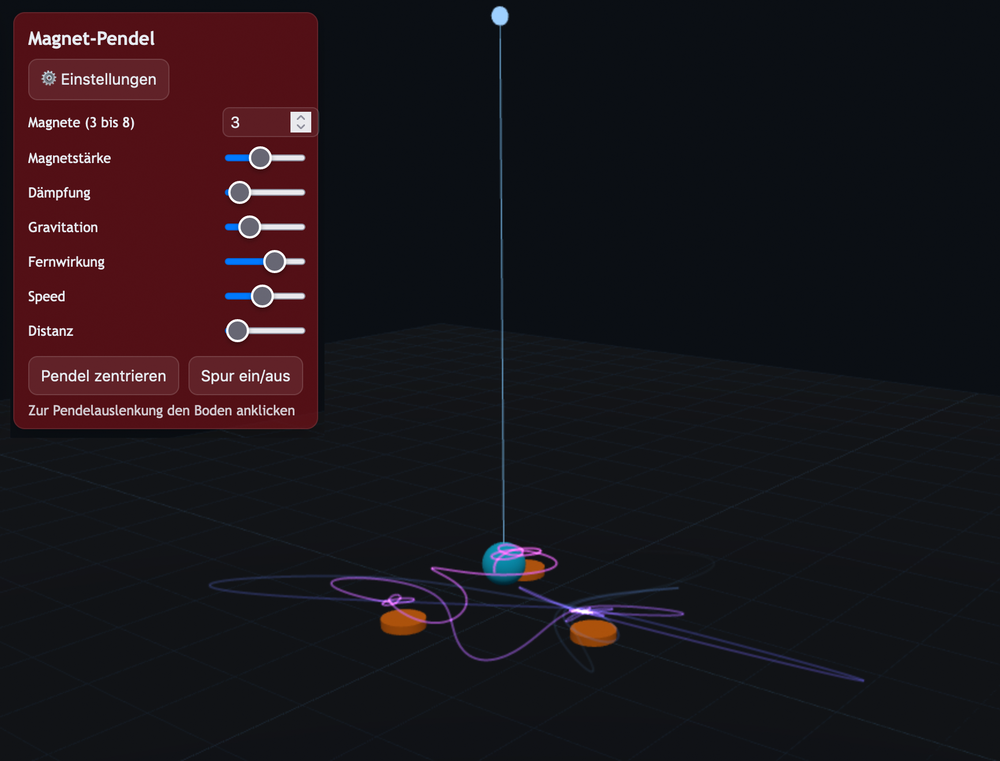

# magnetpendel
Magnetic Pendulum simulation using [three.js](https://threejs.org/)



## Description
This project simulates a magnetic pendulum using three.js for 3D visualization. The pendulum's motion is influenced by multiple magnets, resulting in interesting chaotic patterns.

## Installation

1. Clone the repository:
    ```bash
    git clone https://github.com/Ulli-S/magnetpendel.git
    ```
2. Open `index.html` in your browser.

## Usage
- Move your mouse or interact with the simulation to see how the pendulum behaves under different initial conditions.

## Requirements
- [three.js](https://threejs.org/) (included via CDN or local file)
- A modern web browser

## License
MIT


